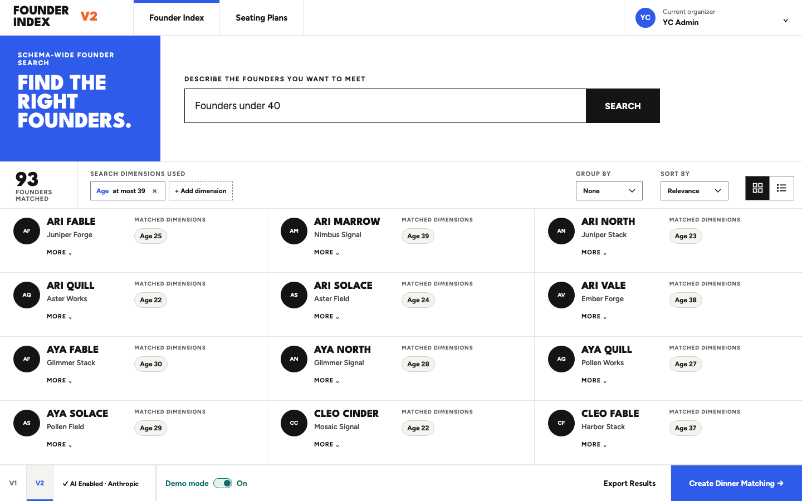
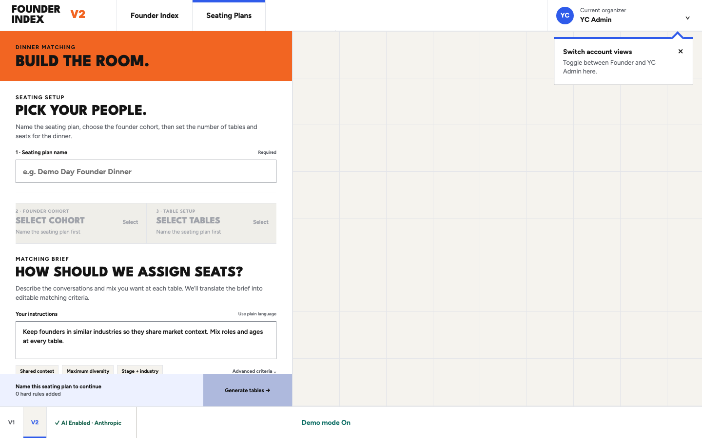
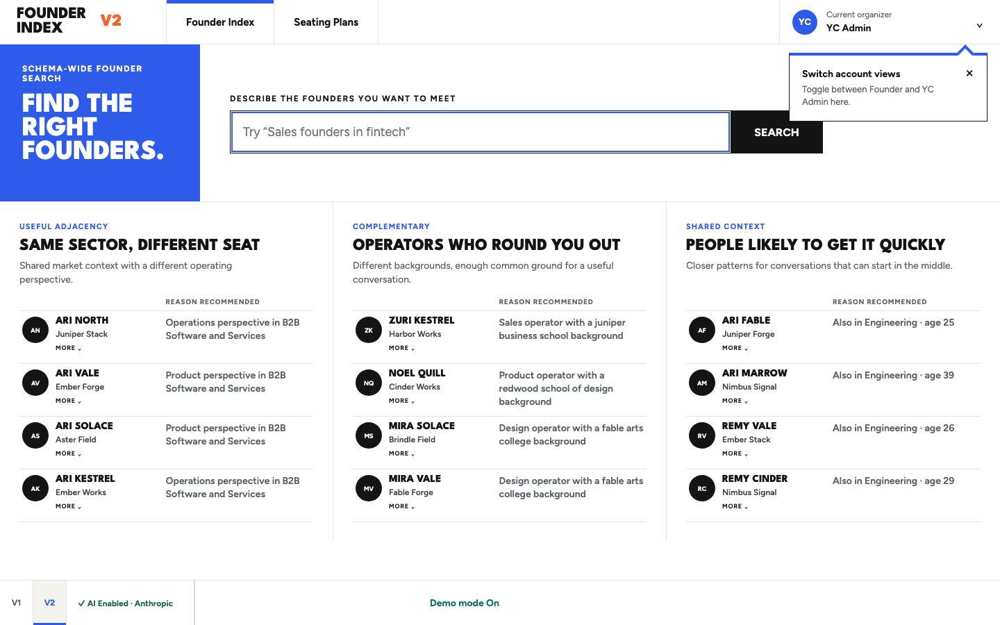
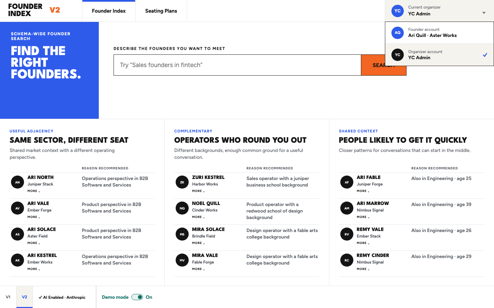
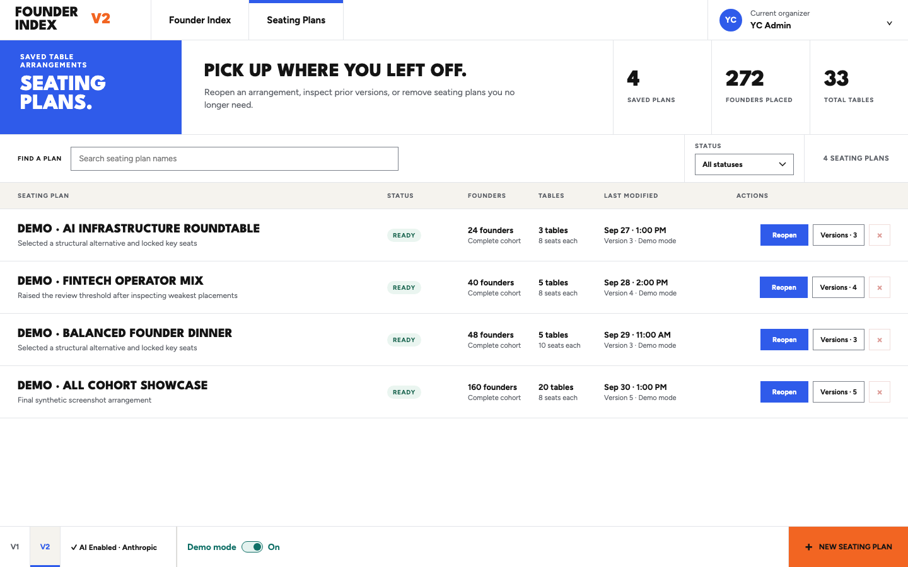
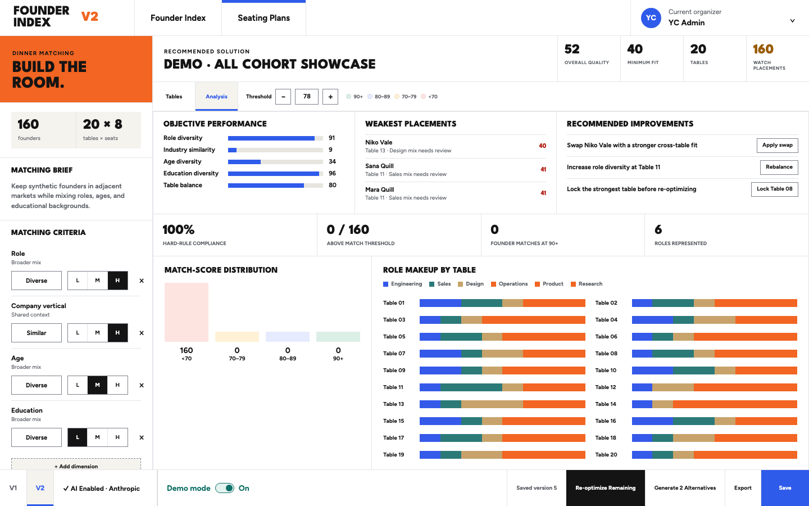
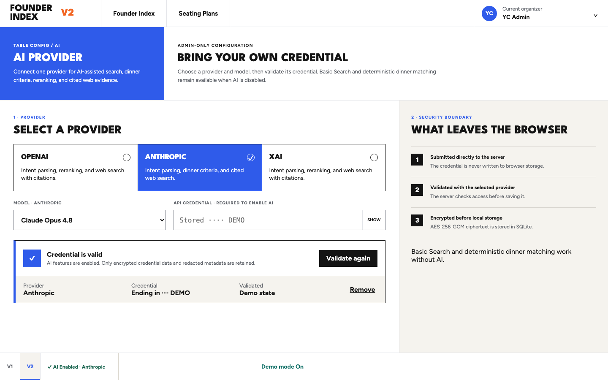

# Founder Index

A reviewable prototype for founder discovery, structured search, and organizer-controlled
seating plans.

**Live public demo:** <https://founder-index-demo.onrender.com/v2>

## Learn About Features

<table>
  <tr>
    <td width="50%">
      <a href="docs/showcase/images/02-search-grid.png"></a>
      <a href="docs/showcase/images/07-dinner-configuration.png"></a>
      <strong>Move from search to a seating arrangement.</strong><br>
      Search, refine the cohort, then hand the ordered founders directly into dinner setup.
    </td>
    <td width="50%">
      <a href="docs/showcase/images/01-search-zero.png"></a>
      <strong>Understand the index without searching.</strong><br>
      The zero-query state explains adjacent, complementary, and shared-context founders before anyone types.
    </td>
  </tr>
  <tr>
    <td width="50%">
      <a href="docs/showcase/images/17-account-modes.png"></a>
      <strong>Use the product as a founder or an organizer.</strong><br>
      Founder mode focuses on discovery and export. YC Admin mode unlocks saved plans and dinner matching.
    </td>
    <td width="50%">
      <a href="docs/showcase/images/06-seating-plans-populated.png"></a>
      <strong>Explore safely with Demo data.</strong><br>
      The public site is read-only and uses 160 fictitious founders plus sample seating history.
    </td>
  </tr>
  <tr>
    <td width="50%">
      <a href="docs/showcase/images/10-analysis.png"></a>
      <strong>Analyze the seating arrangement.</strong><br>
      Review objective performance, weak placements, score distribution, role mix, and recommended improvements.
    </td>
    <td width="50%">
      <a href="docs/showcase/images/15-ai-provider.png"></a>
      <strong>Add AI without making it a dependency.</strong><br>
      AI can interpret searches, suggest criteria, rerank results, and gather cited evidence; deterministic search and matching still work without it.
    </td>
  </tr>
</table>

The public demo is read-only and uses fictitious founder data.

## Product surfaces

- `/v2/search` — schema-wide founder discovery, structured search, and explainable recommendations
- `/v2/seating-plans` — saved seating arrangements, version history, and recovery warnings
- `/v2/dinner` — cohort setup, matching criteria, table optimization, manual edits, analysis, and export
- `/v2/settings/ai` — server-side provider status and credential validation

## Run locally

```bash
npm install
npm run dev
```

Open the URL printed by Vite.

## Deploy the public demo on Render

Live public demo: <https://founder-index-demo.onrender.com/v2>

The checked-in `render.yaml` creates a free Render web service from this
repository. It forces Demo mode and rejects mutating V2 API requests, so public
visitors can explore fictitious founders and sample seating plans without
storing provider credentials or changing shared data.

1. In Render, choose **New → Blueprint**.
2. Connect the `alexselig/founder-matching-app` GitHub repository.
3. Select the repository's `render.yaml` and apply the Blueprint.
4. Wait for `/healthz` to report a healthy deployment, then open the generated
   `onrender.com` URL.

The free service uses an ephemeral SQLite file because the public demo is
read-only. A private persistent deployment should use a paid service with a
disk mounted at `/var/data`, set `DATABASE_PATH=/var/data/founders.sqlite`, and
keep a single service instance while SQLite remains in use.

## Validate

```bash
npm test
npm run lint
npm run build
npm run preview -- --host 127.0.0.1
```

## V2 server and web enrichment

The production server requires `DATABASE_PATH` and serves the V2 API plus the
built client from one Fastify process. Optional provider adapters are enabled
only when their server-side environment variables are present:

- Anthropic: `ANTHROPIC_API_KEY` (`claude-opus-4-8`)
- OpenAI: `OPENAI_API_KEY` and `OPENAI_MODEL`
- xAI: `XAI_API_KEY` and `XAI_MODEL`

Provider credentials stay server-side. They are never accepted by enrichment
run requests or returned in API responses.

`POST /api/v2/enrichment/runs` starts append-only founder enrichment.
`GET /api/v2/enrichment/runs/:id` and
`GET /api/v2/enrichment/runs/:id/progress` report batch state.
`GET /api/v2/founders/:id/web-results` returns the latest successful evidence
plus redacted run history. Tests inject fake transports and never require live
provider access.

## Data

The prototype checks in the dataset published at:

<https://gitlab.com/-/snippets/5976927/raw/main/founder-dinner-matching.json>

It contains 574 founders and the following supplied fields: name, company,
company vertical, age, education, role, historical group, and historical group
section.

Batch and interests are not present. The interface marks those grouping
parameters unavailable instead of fabricating values.

## Matching and grouping

Founder discovery is deterministic and explainable. It uses the structured
profile fields only and does not present scores as scientific compatibility.

Dinner grouping is a deterministic heuristic. Organizers choose a Similar,
Diverse, Balanced, or Random arrangement and select the available parameters.
Groups differ in size by no more than one, and same-company founders are
strongly discouraged from sharing a table. Because assignment is greedy, that
penalty does not guarantee globally optimal separation.

## Feedback persistence

Plan feedback is autosaved to `localStorage` under
`founder-plan-feedback-v1`. Exported feedback is a JSON file suitable for
sharing or committing. The app does not provide a destructive reset action.
